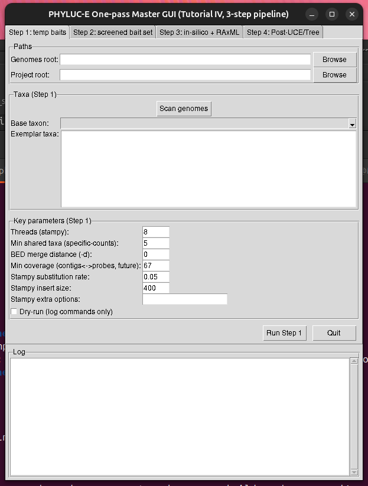

# PHYLUCE_GUI: A graphical user interface (GUI) for the PHYLUCE pipeline





## License Statement:  Distributed under a Creative Commons Attribution-NonCommercial 4.0 International License 
The software, including Stampy components, is provided "AS IS," without warranty of any kind, express or implied, including but not limited to the warranties of merchantability, fitness for a particular purpose, and non-infringement. In no event shall the authors or copyright holders be liable for any claim, damages, or other liability, whether in an action of contract, tort, or otherwise, arising from, out of, or in connection with the software or the use or other dealings in the software. Furthermore, use of this software is strictly restricted to non-commercial purposes only (as defined by the accompanying
Creative Commons Attribution-NonCommercial 4.0 International License or similar academic license terms); any commercial use requires obtaining a separate license from the original copyright holders.

## About
This is a simple Graphical User Interface (GUI) for the PHYLUCE pipeline that tries to mirror the Tutorial IV from the PHYLUCE Readthedocs : https://phyluce.readthedocs.io/en/latest/tutorials/tutorial-4.html

If you use this code you must also cite PHYLUCE and Stampy along with a few other helpers LASTAL 

The GUI will help students and users of all levels keep organized and make the bar to entry of doing phylogenomics less intimidating. There are also a few good things that I added such as accepting spaces in some (but not all ) file names (spaces in file names should be avoided) it also solve a memory bloom issue at the lastz alignment step by writing the sql database in a step-wise manner. Other than these small additions it is basically PHYLUCE wrapped in a GUI, that students can run on their laptops. It assumes you already have assembled genomes. OK have fun with it and I hope it helps to improve your phylogenomic workflow.

## Summary and Install
## phyluce-one-pass (GUI + wrappers)

A small GUI + a set of wrappers around **PhyLUCE Tutorial IV** (UCE probe design + in-silico test),
with extra safeguards for non-interactive runs (no `[y/n]` prompts), memory bloom avoidance and for paths containing spaces.

This repository also vendors the exact Stampy version used by the pipeline (`stampy-1.0.28/`).

## What this runs

The pipeline is very similar to and wraps major parts of the official PhyLUCE Tutorial IV workflow:
https://phyluce.readthedocs.io/en/latest/tutorials/tutorial-4.html

Key steps include:
- Probe design / duplicate screening (LASTZ)
- In-silico test of bait design against genomes (LASTZ)
- UCE alignment (MAFFT), trimming (Gblocks), concatenation
- Tree inference (RAxML)

## Requirements

Data requirements:
Please note that you need assembled genomes to start running this pipeline (fasta format) but that's it no other data required.

Software requirements:
- Linux recommended
- Conda (Miniconda/Miniforge/Mambaforge)
- Three conda envs are used:
  - `phyluce-one-pass-gui`  (GUI runtime)
  - `phyluce-1.7.3`         (PHYLUCE + external bioinformatics tools)
  - `stampy_py27`           (Python 2.7 runtime for Stampy)

## Installation

```bash
git clone https://github.com/alexrvandam/PHYLUCE_GUI.git
cd PHYLUCE_GUI

# Create envs
conda env create -f gui_envs/phyluce-one-pass-gui.yml
conda env create -f gui_envs/phyluce-1.7.3.yml
conda env create -f gui_envs/stampy_py27.yml
```

Then simply open a Terminal and run:
```bash
conda activate phyluce-one-pass-gui
python phyluce_one_pass_master_gui_v3.py
```
That's it you are ready to go! 

Notes / Troubleshooting
1) Avoid interactive PhyLUCE prompts

These wrappers try to prevent PhyLUCE from asking interactive overwrite questions
(which can crash in GUI/subprocess mode).

2) Paths with spaces

Some steps avoid paths with spaces by using relative paths and/or temporary working directories.
Still, the simplest path is: avoid spaces in project paths when possible.

3) Stampy

Stampy is vendored in stampy-1.0.28/ and executed using:
conda run -n stampy_py27 python stampy-1.0.28/stampy.py

If Stampy complains about compilation/toolchain issues on your system,
install build tools (e.g. build-essential) or use conda-forge compilers.

Third-party software (install/cite)

This project does not re-implement these tools — it orchestrates them:

PhyLUCE (Faircloth lab)

https://github.com/faircloth-lab/phyluce

https://phyluce.readthedocs.io/

Stampy read mapper (Lunter & Goodson 2011)

https://github.com/uwb-linux/stampy

Paper: https://pmc.ncbi.nlm.nih.gov/articles/PMC3106326/

LASTZ pairwise aligner

https://github.com/lastz/lastz

https://lastz.github.io/lastz/

MAFFT multiple sequence aligner

https://mafft.cbrc.jp/

Gblocks alignment trimming

https://molevol-ibe.csic.es/Gblocks.html

RAxML phylogenetic inference

https://github.com/stamatak/standard-RAxML

Additional utilities installed via Bioconda:

ART (art_illumina), BWA, SAMtools, BEDTools, BCFtools, BAMTools, UCSC faToTwoBit


If you use this GUI and or it's code you must cite this page along with the other programs!
Here are the needed bibliography citations:
# References to Cite
@misc{VanDam2025PHYLUCEGUI,
  author       = {Van Dam, Alex R.},
  title        = {PHYLUCE\_GUI: A graphical user interface (GUI) for the PHYLUCE pipeline},
  year         = {2025},
  howpublished = {GitHub repository},
  url          = {https://github.com/alexrvandam/PHYLUCE_GUI},
  note         = {Accessed 2025-12-16}
}

@article{Faircloth2016PHYLUCE,
  author  = {Faircloth, Brant C.},
  title   = {{PHYLUCE} is a software package for the analysis of conserved genomic loci},
  journal = {Bioinformatics},
  year    = {2016},
  volume  = {32},
  number  = {5},
  pages   = {786--788},
  doi     = {10.1093/bioinformatics/btv646},
  url     = {https://doi.org/10.1093/bioinformatics/btv646}
}

@article{Lunter2011Stampy,
  author  = {Lunter, Gerton and Goodson, Michael},
  title   = {Stampy: a statistical algorithm for sensitive and fast mapping of {Illumina} sequence reads},
  journal = {Genome Research},
  year    = {2011},
  volume  = {21},
  number  = {6},
  pages   = {936--939},
  doi     = {10.1101/gr.111120.110},
  url     = {https://doi.org/10.1101/gr.111120.110}
}

@phdthesis{Harris2007LASTZ,
  author = {Harris, Robert S.},
  title  = {Improved pairwise alignment of genomic {DNA}},
  school = {The Pennsylvania State University},
  year   = {2007},
  url    = {https://www.bx.psu.edu/~rsharris/lastz/},
  note   = {Cited as recommended by the LASTZ author; accessed 2025-12-16}
}

@article{Katoh2013MAFFT,
  author  = {Katoh, Kazutaka and Standley, Daron M.},
  title   = {{MAFFT} multiple sequence alignment software version 7: improvements in performance and usability},
  journal = {Molecular Biology and Evolution},
  year    = {2013},
  volume  = {30},
  number  = {4},
  pages   = {772--780},
  doi     = {10.1093/molbev/mst010},
  url     = {https://doi.org/10.1093/molbev/mst010}
}

@article{Castresana2000Gblocks,
  author  = {Castresana, Jose},
  title   = {Selection of conserved blocks from multiple alignments for their use in phylogenetic analysis},
  journal = {Molecular Biology and Evolution},
  year    = {2000},
  volume  = {17},
  number  = {4},
  pages   = {540--552},
  doi     = {10.1093/oxfordjournals.molbev.a026334},
  url     = {https://doi.org/10.1093/oxfordjournals.molbev.a026334}
}

@article{Stamatakis2014RAxML,
  author  = {Stamatakis, Alexandros},
  title   = {{RAxML} version 8: a tool for phylogenetic analysis and post-analysis of large phylogenies},
  journal = {Bioinformatics},
  year    = {2014},
  volume  = {30},
  number  = {9},
  pages   = {1312--1313},
  doi     = {10.1093/bioinformatics/btu033},
  url     = {https://doi.org/10.1093/bioinformatics/btu033}
}

@article{Li2009BWA,
  author  = {Li, Heng and Durbin, Richard},
  title   = {Fast and accurate short read alignment with {Burrows--Wheeler} transform},
  journal = {Bioinformatics},
  year    = {2009},
  volume  = {25},
  number  = {14},
  pages   = {1754--1760},
  doi     = {10.1093/bioinformatics/btp324},
  url     = {https://doi.org/10.1093/bioinformatics/btp324}
}

@article{Li2009SAMtools,
  author  = {Li, Heng and Handsaker, Bob and Wysoker, Alec and others},
  title   = {The Sequence Alignment/Map format and {SAMtools}},
  journal = {Bioinformatics},
  year    = {2009},
  volume  = {25},
  number  = {16},
  pages   = {2078--2079},
  doi     = {10.1093/bioinformatics/btp352},
  url     = {https://doi.org/10.1093/bioinformatics/btp352}
}

@article{Danecek2021SAMtoolsBCFtools,
  author  = {Danecek, Petr and Bonfield, James K. and Liddle, Jennifer and others},
  title   = {Twelve years of {SAMtools} and {BCFtools}},
  journal = {GigaScience},
  year    = {2021},
  volume  = {10},
  number  = {2},
  pages   = {giab008},
  doi     = {10.1093/gigascience/giab008},
  url     = {https://doi.org/10.1093/gigascience/giab008}
}

@article{Quinlan2010BEDTools,
  author  = {Quinlan, Aaron R. and Hall, Ira M.},
  title   = {{BEDTools}: a flexible suite of utilities for comparing genomic features},
  journal = {Bioinformatics},
  year    = {2010},
  volume  = {26},
  number  = {6},
  pages   = {841--842},
  doi     = {10.1093/bioinformatics/btq033},
  url     = {https://doi.org/10.1093/bioinformatics/btq033}
}

@article{Barnett2011BamTools,
  author  = {Barnett, Derek W. and Garrison, Erik K. and Quinlan, Aaron R.},
  title   = {{BamTools}: a {C++} {API} and toolkit for analyzing and managing {BAM} files},
  journal = {Bioinformatics},
  year    = {2011},
  volume  = {27},
  number  = {12},
  pages   = {1691--1692},
  doi     = {10.1093/bioinformatics/btr174},
  url     = {https://doi.org/10.1093/bioinformatics/btr174}
}

@article{Huang2012ART,
  author  = {Huang, Weichun and Li, Leping and Myers, J. R. and Marth, Gabor T.},
  title   = {{ART}: a next-generation sequencing read simulator},
  journal = {Bioinformatics},
  year    = {2012},
  volume  = {28},
  number  = {4},
  pages   = {593--594},
  doi     = {10.1093/bioinformatics/btr708},
  url     = {https://doi.org/10.1093/bioinformatics/btr708}
}

@article{Perez2025UCSC,
  author  = {Perez, Gerardo and Barber, Glenn P. and Benet-Pag{\`e}s, A. and others},
  title   = {The {UCSC} Genome Browser database: 2025 update},
  journal = {Nucleic Acids Research},
  year    = {2025},
  volume  = {53},
  number  = {D1},
  pages   = {D1243--D1249},
  doi     = {10.1093/nar/gkae974},
  url     = {https://doi.org/10.1093/nar/gkae974}
}

